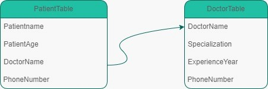

##
Projenin motivasyonu:
Projeyi hayata geçirmemi sağlayan motivasyon, C# dilini öğrenip hakim olmak, programlama konusunda kendimi geliştirmek ve veritabanları bilgimi artırmak istememdir çünkü bu gelecek dönem çalışacağımız bir konu.

Projenin amaci:
Giriş yaptığımızda doktor ve hasta tablolarının olduğu bir ekrana gidiyoruz.Doktor tablosunu seçerken doktor listesine geçiyor ve doktorların isim,uzmanlık,yaş,telefon numarası gibi verilerini gösteriyor.Yeni doktorlar alınabiliyor. Hasta tablosuna tıklandığında hasta listesine geçerek hastaların medikal durumu gibi verilerini gösterir ve hasta eklenebilmektedirYeni ve her hasta özel doktor tarafından tedavi edilmektedir.

Veritabanlari:
iki tablo oluşturmam gerekecek, doktorlar için bir tablo ve hastalar için bir tablo.
##

